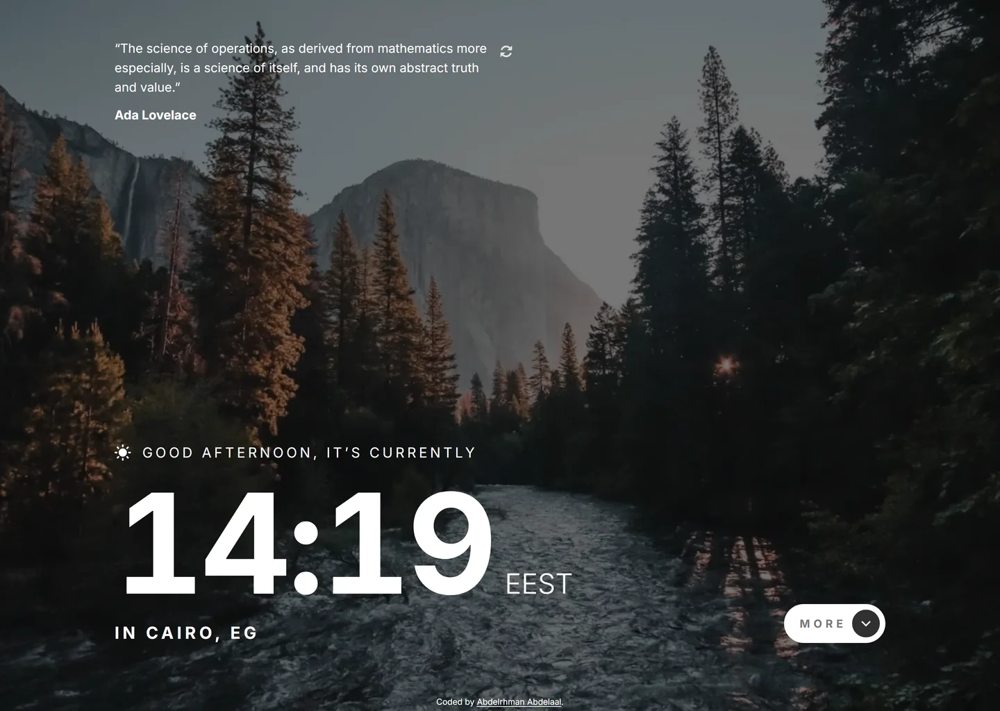

# Clock app

My solution to the [Clock app](https://www.frontendmentor.io/challenges/clock-app-LMFaxFwrM) challenge on Frontend Mentor.

- Live: https://clock-app.abdelrhman-ahmed8881.workers.dev
- Code: https://github.com/MrBlackvanta/clock-app

## Built with

- Next.js
- React
- TypeScript
- Tailwind CSS

## Author

- [LinkedIn](https://www.linkedin.com/in/abdelrhman-vanta/)
- [UpWork](https://www.upwork.com/freelancers/mrblackvanta)
- [Frontend Mentor](https://www.frontendmentor.io/profile/MrBlackvanta)
